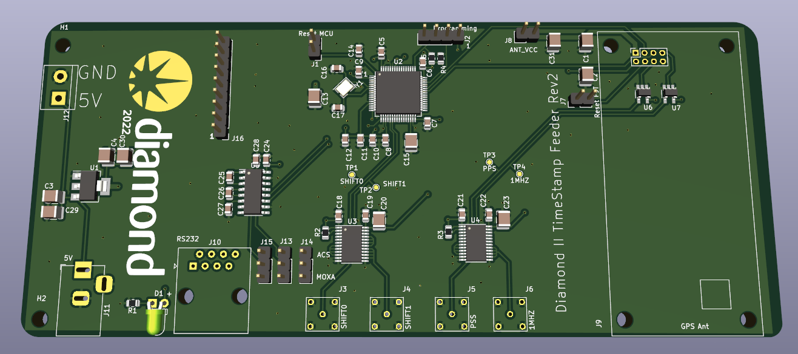

# Diamond II TimeStamp Feeder Hardware

This repository contains the PCB design for the board that obtains timestamps
from a GPS receiver (Ublox RCB-F9T) and pushes it to an EVG.

The output signals are: PPS, 1MHZ, SHIFT0 and SHITF1

